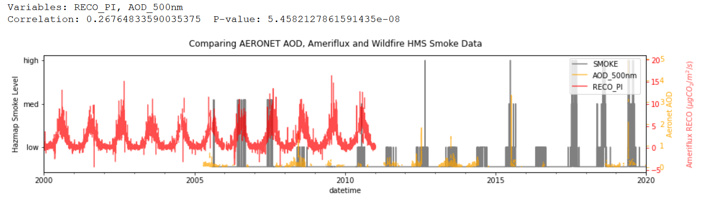

<!-- #region -->
# Effects of Large Scale Smoke Events on Forest Productivity in Central Canada

Code Author: Andrew Loeppky

aloeppky@eoas.ubc.ca <br>
https://github.com/AndrewLoeppky/wildfire_drf

Supervisor: Dr. Ian Mckendry

This code repository is meant to acquire and process long-term timeseries related to smoke events throughout Canada and draw conclusions about the effects of high optical-depth smoke events on ecosystems ability to act as atmospheric CO2 sinks. In the current state, all code is aimed at the Old Black Spruce/Waskesiu Aeronet sites in Prince Albert National Park, SK, CAN, but efforts have been made to write code that is as general as possible, so analyses can be performed at other locations with both Ameriflux and AERONET stations.

## Data Sources and Processing Routines

### Aerocan

Aerocan is the Canadian division of AERONET, a global network of sun photometers, the measurement of interest to this study is the aerosol optical depth in the photosynthetically active radiation band (currently represented by the 500nm measurement, although the code can be configured to process more bands or a wider average)

https://aeronet.gsfc.nasa.gov/cgi-bin/data_display_aod_v3?site=Waskesiu&nachal=2&level=1&place_code=10

To acquire this data, follow the URL above and download the AOD level 1.5 data (at Waskesiu or from your site of choice, be sure to credit the site PI for data used). Unzip the file and change the file extension from `filename.lev15` to `filename.csv`

Once the data is downloaded, open `process_aeronet.py` in an editor (I'm using jupyter notebooks adapted to write .py files, see [jupytext docs](https://pypi.org/project/jupytext/) or [VScode extension for jupyter](https://code.visualstudio.com/docs/datascience/jupyter-notebooks)) and modify the file paths (cell 2 and the `main()` function call at the end of the code) to point to your raw dataset. Run the program to produce a cleaned csv file. (modify the function `save_dataset()` to choose where to save your output)


### Hazard Mapping System

The wildfire hazard mapping system (HMS) is a series of satallite data products generated by NOAA to do with North American wildfires. The main site for the hazard mapping system can be found [here](https://www.ospo.noaa.gov/Products/land/hms.html#maps), however, this project accesses data from the data archives found at:

https://satepsanone.nesdis.noaa.gov/pub/FIRE/web/HMS/

For processing short datasets, shapefiles describing smoke plumes can be downloaded manually from this website. For longer datasets, use the `scrape_hazmap.py` program to save the data to your local disk for further processing (email me if you need help). Smoke polygons are available in KML (i.e. google earth) or shapefile (i.e. arcGIS) formats, and `scrape_hazmap.py` included functionality for aquiring either. Note the scraper takes ~12 hours to run over a 20 year period depending on your processor. I recommend first running a short interval to make sure it is working, then run again with your full date interval.

After downloading or scraping the data over your specified interval, open `process_hazmap.py` and fill modify cell 3 (under the `## inputs` comment) to specify your site lat/lon, name and desired time interval. Run the program to produce a csv of the HMS smoke level at your specified lat/lon. 

**Notes** 

* This program is not tied to any field site, you can enter any coorinates you wish. 

* Processing time is very long, 1 year of hourly data takes about an hour to run. I'll try to fix this eventually.

* The "smoke levels" are ordinal values and the numerical values should not be taken seriously. Values of 0, 5.0, 16.0 and 27.0 represent none, light, medium and heavy smoke respectively. This data is curated by hand (someone draws a shape around the smoke on a satellite image a few times a day). 


### Ameriflux

Ameriflux is a network of field sites throughout north, central and south america dedicated to monitoring CO2, water, and energy fluxes. Data can be found here:

https://ameriflux.lbl.gov/sites/site-search/#searchbar=CA&filter-type=all&has-data=All&site_id=

Which data products are available depend on site-specific instrumentation. See particular site metadata for further details.

To scrub Ameriflux data, open `process_ameriflux.py`, edit cell 2 and run the program. It will produce a csv of hourly data. The present version keeps all fields provided in the raw dataset, and resamples for timestamps on the hour.


### Correlating and Plotting Data

Once all three datasets are saved to disk as CSV's via the three data scrubbing routines outlined above, open `make_big_plot.ipynb` in a jupyter notebook editor and enter the desired plotting parameters into the first cell (labelled 'user inputs'). This allows you to select a time period over which to **A:** Plot a time series of all three synchronized datasets over the specified interval, and **B:** Calculate the [Spearman correlation coefficient](https://towardsdatascience.com/discover-the-strength-of-monotonic-relation-850d11f72046) and corresponding P-value of any two selected varaibles. Parameters can be chosen from the following list (created for OBS ameriflux and waskesiu aeronet station, other stations may vary in notation and available data)

```
>> TIME =========================================================================
datetime    pandas datetime objects - notation dynamically changes
            to adjust for time period on plot
            
>> HAZMAP =======================================================================
smoke       (nil, low, med, high) Smoke Level as calculated from the wildfire 
            hazard mapping system
            
>> AERONET ======================================================================

AOD_XXXnm  Aerosol Optical Depth at a specified wavelengh. Available wavelengths
           are: 1020, 870, 865, 779, 675, 667, 620, 560, 555, 551, 532, 531, 
           510, 500, 490, 443, 440, 412, 400, 380, 340 (nm)
           Typically 500nm is taken to be representative of PAR

Precipitable_Water(cm) total precipitable water in the column
Ozone(Dobson)          calculated ozone concentration
NO2(Dobson)            calculated nitrogen dioxide concentration

>> AMERIFLUX ===================================================================

-- GASES
CO2         (umolCO2 mol-1): Carbon Dioxide (CO2) mole fraction
H2O           (mmolH2O mol-1): Water (H2O) vapor mole fraction
CH4        (nmolCH4 mol-1): Methane (CH4) mole fraction
FC            (umolCO2 m-2 s-1): Carbon Dioxide (CO2) flux
SC            (umolCO2 m-2 s-1): Carbon Dioxide (CO2) storage flux
FCH4        (nmolCH4 m-2 s-1): Methane (CH4) flux
SCH4        (nmolCH4 m-2 s-1): Methane (CH4) storage flux

-- HEAT
G           (W m-2): Soil heat flux
H           (W m-2): Sensible heat flux
LE          (W m-2): Latent heat flux
SH          (W m-2): Heat storage in the air
SLE         (W m-2): Latent heat storage flux

-- MET_WIND
WD            (Decimal degrees): Wind direction
WS            (m s-1): Wind speed
USTAR    (m s-1): Friction velocity
ZL            (adimensional): Stability parameter

-- MET_ATM
PA             (kPa): Atmospheric pressure
RH             (%): Relative humidity, range 0-100
TA             (deg C): Air temperature
VPD        (hPa): Vapor Pressure Deficit

-- MET_SOIL
SWC        (%): Soil water content (volumetric), range 0-100
TS          (deg C): Soil temperature
WTD        (m): Water table depth

-- MET_RAD
NETRAD       (W m-2): Net radiation
PPFD_IN      (umolPhoton m-2 s-1): Photosynthetic photon flux density, incoming
PPFD_OUT     (umolPhoton m-2 s-1): Photosynthetic photon flux density, outgoing
SW_IN       (W m-2): Shortwave radiation, incoming
SW_OUT       (W m-2): Shortwave radiation, outgoing
LW_IN        (W m-2): Longwave radiation, incoming
LW_OUT      (W m-2): Longwave radiation, outgoing

-- MET_PRECIP
P              (mm): Precipitation

-- PRODUCTS
NEE        (umolCO2 m-2 s-1): Net Ecosystem Exchange
RECO        (umolCO2 m-2 s-1): Ecosystem Respiration
GPP        (umolCO2 m-2 s-1): Gross Primary Productivity
```

After editing the "user inputs" cell, restart the kernel and run the whole program. The output is a string of text describing the correlation and p-value, a time series plot of your selected variables, and a boxplot showing your variable integrated over the selected interval, separated by Hazmap Smoke level. Sample plots:



<!-- #endregion -->
